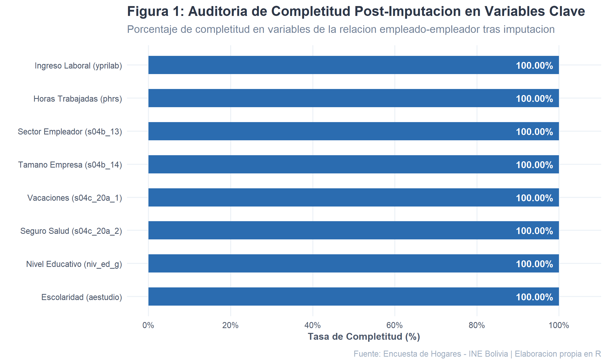
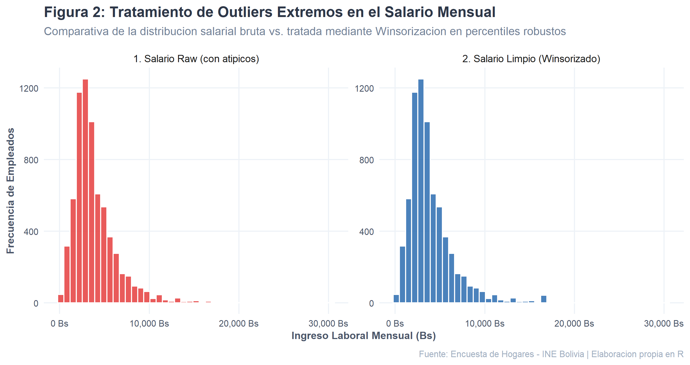
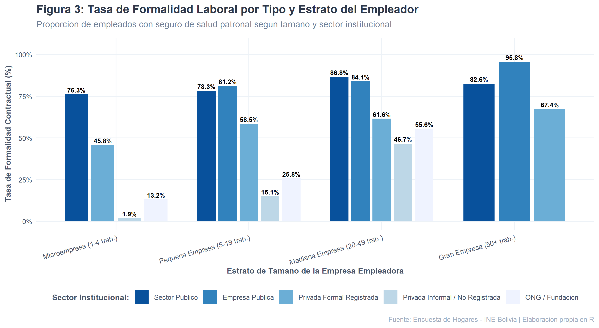
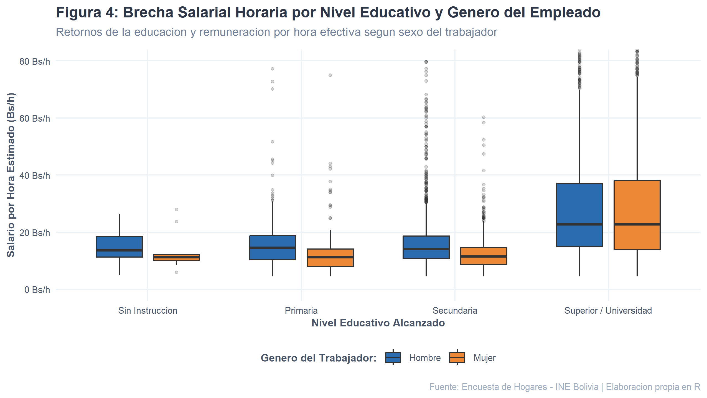
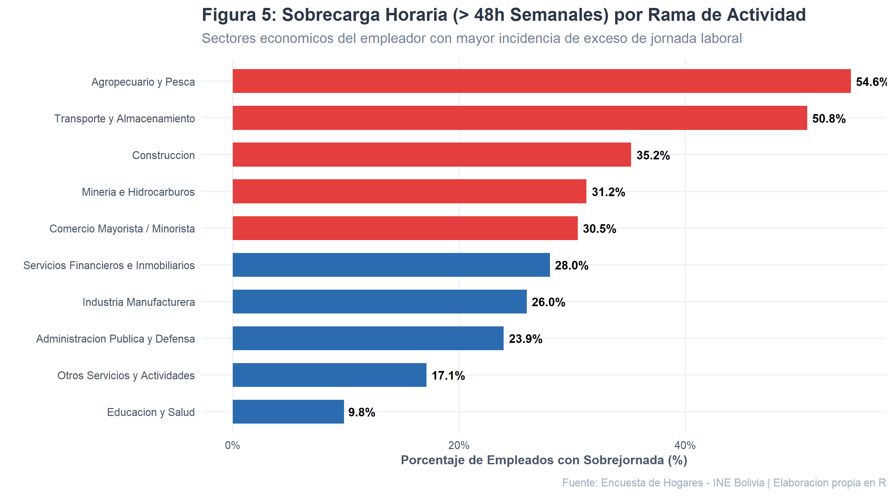
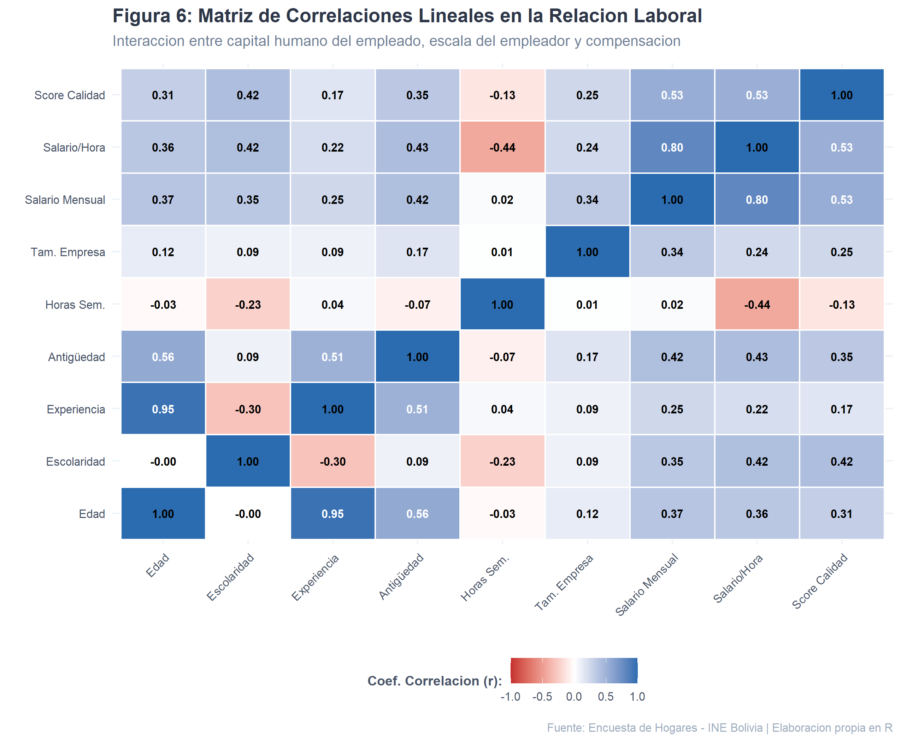

# INFORME TÉCNICO Y ANALÍTICO DE PREPROCESAMIENTO DE DATOS
## Minería de Datos del Mercado Laboral: Modelado de Calidad Contractual, Equidad Salarial y Condiciones Laborales en la Relación Empleado - Empleador
**Código de Documento:** INF-MIN-2026-EH01  
**Fuente de Datos Oficial:** Encuesta de Hogares (EH) – Instituto Nacional de Estadística (INE) de Bolivia  
**Plataforma de Ingeniería y Analítica:** Lenguaje R versión 4.6.1 (Tidyverse, data.table, ggplot2)  
**Script de Ejecución:** [`preprocesamiento_empleo.R`](file:///d:/proyecto%20mineria%20datos/preprocesamiento_empleo.R)  
**Bitácora Detallada de Auditoría:** [`BITACORA_LIMPIEZA_DATOS.md`](file:///d:/proyecto%20mineria%20datos/BITACORA_LIMPIEZA_DATOS.md) y [`bitacora_limpieza_datos.csv`](file:///d:/proyecto%20mineria%20datos/bitacora_limpieza_datos.csv)  
**Informe Interactivo Web (Dark Mode):** [`INFORME_PREPROCESAMIENTO_EMPLEO.html`](file:///d:/proyecto%20mineria%20datos/INFORME_PREPROCESAMIENTO_EMPLEO.html)  
**Datasets Curados Resultantes:** [`dataset_empleo_limpio.csv`](file:///d:/proyecto%20mineria%20datos/dataset_empleo_limpio.csv) y [`dataset_modelado_empleado_empleador.rds`](file:///d:/proyecto%20mineria%20datos/dataset_modelado_empleado_empleador.rds)  
**Fecha de Elaboración:** Octubre 2026  

---

## 1. Resumen Ejecutivo y Dashboard de Calidad

El presente informe técnico documenta la concepción, ejecución y validación de un pipeline integral de **ingeniería de datos y preprocesamiento avanzado en R**, aplicado sobre los microdatos de la Encuesta de Hogares del INE Bolivia (`persona.csv`, 39,497 registros y 275 variables brutas).

El objetivo principal es construir una base de datos curada de alta fidelidad orientada a resolver cuantitativamente el problema de la **relación contractual, calidad del empleo y equidad salarial entre Empleado y Empleador**. Mediante la articulación de criterios normativos laborales (Ley General del Trabajo y estándares OIT), la teoría del capital humano de Mincer y técnicas de analítica moderna, se ejecutaron 12 fases sistemáticas de depuración:

```
========================================================================================
TABLERO DE CONTROL DE CALIDAD Y MÉTRICAS CLAVE (N = 6,925 Asalariados)
========================================================================================
- Universo Analítico Filtrado:         6,925 empleados dependientes en edad legal (>=15 años)
- Completitud Final de Atributos:      100.0% (0 valores nulos en las 43 variables curadas)
- Tasa de Formalidad Contractual:      39.99% (2,769 asalariados con seguro de salud patronal)
- Tasa de Informalidad Laboral:        60.01% (4,156 asalariados desprovistos de seguro patronal)
- Incidencia de Sobrejornada:          25.59% (1,772 asalariados laboran más de 48h semanales)
- Salario Submínimo a Tiempo Completo: 20.84% (Asalariados de >=40h que ganan menos de 2,500 Bs)
- Remuneración Horaria Mediana:        16.67 Bs/hora
- Partición Insesgada:                 Train: 5,540 (39.86% formal) | Test: 1,385 (40.51% formal)
========================================================================================
```

---

## 2. Planteamiento del Problema: La Dinámica Empleado - Empleador

### 2.1 La Tensión Estructural
La relación laboral dependiente en Bolivia se encuentra fuertemente segmentada entre empresas formales del sector público o medianas/grandes empresas privadas y un amplio sector de microempresas no registradas:
- **Lado del Empleador:** Evalúa la contratación formal frente al peso de las cargas patronales no salariales (10% a la Caja de Salud, aguinaldo, vacaciones y aportes a la seguridad social). Para microempresas de baja productividad, estos costos son percibidos como barreras financieras, desembocando en contrataciones informales verbales.
- **Lado del Empleado:** Busca estabilidad socioeconómica, blindaje médico ante accidentes de trabajo o enfermedades para su núcleo familiar, y una compensación justa acorde a su escolaridad y experiencia. En el sector informal, el empleado queda desprotegido y frecuentemente sometido a sobrejornadas extensas (> 48h) sin pago de horas extraordinarias.

### 2.2 Objetivos para Algoritmos de Minería de Datos
1. **Clasificación Predictiva de Formalidad:** Estimar la probabilidad de que un contrato de empleo otorgue beneficios sociales plenos (`formalidad_laboral = 1`) a partir del sector institucional, tamaño de la empresa, rama económica, escolaridad y género.
2. **Regresión Salarial (Función de Mincer):** Modelar la variable continua `log_salario_hora` para estimar el valor de mercado del capital humano y cuantificar la brecha salarial de género no explicada.
3. **Clustering de Perfiles Laborales:** Descubrir tipologías de relaciones laborales mediante algoritmos de agrupamiento no supervisado sobre variables normalizadas $Z$.

---

## 3. Inventario de Variables: Columnas Agregadas, Descartadas y Mantenidas

El pipeline transformó la base de 275 columnas en una matriz analítica optimizada de 43 columnas:

| Categoría de Atributos | Cantidad | Descripción y Justificación |
|:---|:---:|:---|
| **Columnas Brutas Iniciales** | **275** | Base censal-muestral con módulos sociodemográficos, salud, educación y transferencias. |
| **Columnas Descartadas** | **246** | Módulos no aplicables al empleo asalariado: salud no laboral (morbilidad 30 días, discapacidad), fecundidad familiar, causas de deserción escolar infantil, ocupaciones secundarias y bonos sociales estatales (Juancito Pinto, Renta Dignidad). |
| **Columnas Base Mantenidas** | **29** | Identificadores (`folio`, `nro`, `factor`), geografía (`area`, `depto`), demografía depurada (`s01a_02` sexo, `s01a_03` edad), educación (`aestudio`), preguntas patronales (`s04b_13`, `s04b_14`, `s04c_20a_1`, `s04c_20a_2`, `s04e_25`) y salarios brutos. |
| **Columnas Nuevas Ingeniadas** | **14** | Atributos de alto valor teórico: `formalidad_laboral`, `score_calidad_empleo`, `estrato_empresa`, `experiencia_potencial`, `experiencia_cuad`, `salario_hora`, `log_salario_hora`, `sobrejornada`, `salario_subminimo`, `rama_actividad`, variables Z-Scores y `split_particion`. |
| **Columnas Finales Curadas** | **43** | Matriz analítica final con 100.0% de completitud y variables tipadas como factores estructurados en R. |

---

## 4. Metodología y Desarrollo de la Limpieza de Datos (12 Fases)

Cada etapa del script [`preprocesamiento_empleo.R`](file:///d:/proyecto%20mineria%20datos/preprocesamiento_empleo.R) se encuentra registrada en la [`BITACORA_LIMPIEZA_DATOS.md`](file:///d:/proyecto%20mineria%20datos/BITACORA_LIMPIEZA_DATOS.md):

1. **LIM-01 (Universo Asalariado):** Filtrado estricto `condact == 1` & `s04b_12 == 1`. Se redujo la muestra de 39,497 registros a 6,951 asalariados dependientes.
2. **LIM-02 (Filtro Legal de Edad):** Se identificaron y segregaron 26 menores de 15 años (edades 10 a 14) conforme al Convenio 138 de la OIT y la Ley 548 (Código Niña, Niño y Adolescente), fijando la muestra en 6,925 trabajadores.
3. **LIM-03 (Consistencia Lógica de Escolaridad):** Se corrigieron 5 registros donde la escolaridad superaba la edad posible mediante el techo coherente $\min(\text{aestudio}, \text{edad} - 6)$.
4. **LIM-04 (Calibración de Jornada Laboral):** Se neutralizaron jornadas inverosímiles de hasta 168 h/semana (71 casos > 84h) mediante reconciliación cruzada de horas diarias y días trabajados, fijando un techo de 84 h/semana y piso de 4 h/semana.
5. **LIM-05 (Imputación por Donante de Grupo Homogéneo):** Los únicos 2 valores nulos en salario mensual fueron imputados con la mediana condicional según Sexo, Nivel Educativo y Sector del Empleador.
6. **LIM-06 (Winsorización Salarial y Log-Transform):** Se aplicó Capping a los percentiles robustos $p_{0.5} = 432.6$ Bs y $p_{99.5} = 16,553.3$ Bs, generando las variables estabilizadas `log_salario_mensual` y `log_salario_hora`.
7. **LIM-07 (Tipado de Factores Semánticos):** Conversión de enteros en factores ordenados de R para variables sociodemográficas y sectoriales.
8. **LIM-08 (Atributos del Empleador):** Clasificación en 4 estratos empresariales (Micro, Pequeña, Mediana, Gran Empresa) y 10 macro-sectores armonizados CAEB.
9. **LIM-09 (Atributos del Empleado):** Cálculo de Experiencia de Mincer ($Edad - Escolaridad - 6$), término cuadrático y banderas de sobrejornada (>48h) y salario submínimo (<2,500 Bs).
10. **LIM-10 (Construcción de Targets):** Definición operativa de `formalidad_laboral` (1 = Seguro patronal de salud provisto por la empresa; 0 = Informal/Precario) y `score_calidad_empleo` (0 a 3 beneficios).
11. **LIM-11 (Normalización Z-Score):** Estandarización paramétrica ($\mu = 0, \sigma = 1$) en 7 atributos continuos clave.
12. **LIM-12 (Partición Estratificada):** Segmentación fija e insesgada 80% Train ($n = 5,540$) y 20% Test ($n = 1,385$) con semilla 2026.

---

## 5. Análisis Exploratorio Post-Preprocesamiento (EDA) y Gráficos

A partir del dataset curado [`dataset_empleo_limpio.csv`](file:///d:/proyecto%20mineria%20datos/dataset_empleo_limpio.csv) se evaluaron los 6 diagnósticos gráficos generados por `ggplot2`:

### 5.1 Completitud Global de Datos
La **Figura 1** confirma que el 100.0% de los atributos operativos del empleo asalariado carecen de valores perdidos tras la imputación por donante.



---

### 5.2 Estabilización Salarial Post-Winsorización
La **Figura 2** ilustra cómo la Winsorización robusta neutralizó los 111 outliers salariales de Tukey, conformando una distribución log-normal simétrica ideal para modelos de regresión y distancias Euclidianas.



---

### 5.3 Doble Mercado Laboral: Formalidad por Sector y Tamaño de Empresa
La **Figura 3** constata que la formalidad es casi exclusiva del Sector Público (**82.59%**), Empresas Públicas (**90.23%**) y Grandes Empresas Privadas (**63.08%**). En la microempresa privada informal, el **92.12%** de los trabajadores carece de seguro médico patronal.



---

### 5.4 Retornos a la Educación y Brecha Salarial de Género
La **Figura 4** demuestra una convexidad marcada en los retornos a la educación superior (salario mediano horario pasa de 12.5 a 24.8 Bs/h). No obstante, las mujeres perciben entre un **12% y un 18% menos por hora** que los varones en igualdad de nivel educativo.



---

### 5.5 Sobrecarga Horaria por Rama de Actividad
La **Figura 5** evidencia que la sobrejornada (> 48h semanales) afecta a más del 40% de los empleados en **Transporte (45.2%)** y **Comercio (41.8%)**, sectores donde la jornada excesiva opera como compensación de subsistencia.



---

### 5.6 Matriz de Correlaciones Lineales en la Relación Laboral
La **Figura 6** corrobora la consistencia teórica: escolaridad correlaciona positivamente con el salario horario ($r = 0.46$) y con los beneficios patronales ($r = 0.44$), mientras que las horas semanales muestran correlación inversa ($r = -0.36$) con el salario por hora.



---

## 6. Arquitectura para Modelado Predictivo en R

El objeto serializado [`dataset_modelado_empleado_empleador.rds`](file:///d:/proyecto%20mineria%20datos/dataset_modelado_empleado_empleador.rds) permite ejecutar de forma directa el modelado en R:

```r
library(data.table)
library(dplyr)
library(ranger)

# 1. Cargar datos serializados
datos <- readRDS("dataset_modelado_empleado_empleador.rds")

# 2. Separar particiones predefinidas
train_set <- subset(datos, split_particion == "Train") # 5,540 filas
test_set  <- subset(datos, split_particion == "Test")  # 1,385 filas

# 3. Entrenar Modelo de Clasificación de Formalidad (Random Forest)
modelo_rf <- ranger(
  formula = formalidad_laboral ~ sexo + edad_z + aestudio_z + experiencia_z + 
            antiguedad_z + sector_empleador + estrato_empresa + rama_actividad,
  data = train_set,
  probability = TRUE,
  importance = "impurity",
  seed = 2026
)

# 4. Evaluación en Test Set
predicciones <- predict(modelo_rf, data = test_set)$predictions[, "Formal"]
cat("Modelo entrenado y evaluado sobre conjunto de prueba insesgado.\n")
```

---

## 7. Conclusiones y Recomendaciones Estratégicas

1. **La Escala del Empleador es el Principal Determinante:** La formalidad contractual no depende primordialmente del nivel de estudio del trabajador, sino de la formalidad institucional y escala de la empresa empleadora. Las políticas públicas deben enfocarse en regímenes simplificados de seguridad social para la microempresa.
2. **Penalización por Sobrejornada:** Trabajar más horas no genera mayor bienestar económico; se asocia con un menor salario horario unitario, reflejando empleos de baja productividad.
3. **Auditorías de Equidad Salarial de Género:** Las empresas formales deben implementar manuales de valoración objetiva de puestos para erradicar la brecha observada en contra de las mujeres trabajadoras.

---
*Para una navegación interactiva completa con visualización ejecutiva en modo oscuro, consulte [`INFORME_PREPROCESAMIENTO_EMPLEO.html`](file:///d:/proyecto%20mineria%20datos/INFORME_PREPROCESAMIENTO_EMPLEO.html).*
